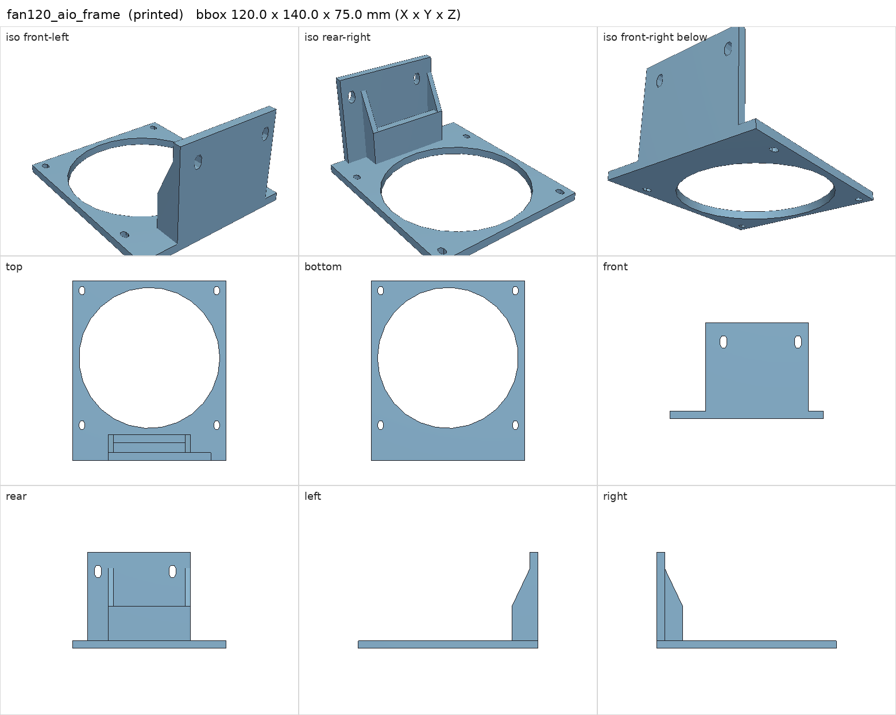

# fan120_aio_frame

<!-- Generated by make check from part.toml. Edit part.toml, not this file. -->

| | |
| --- | --- |
| ID | `fan120_aio_frame` |
| Category | printed |
| Print | plate `08_fan120_aio_frame`, PETG |

## Used in

| Build | Qty | Status | Role |
| --- | ---: | --- | --- |
| [aipc](../../../aipc/parts/fan120_aio_frame.md) | 2 | design | 120 mm fan/radiator frame with 75 mm feet on the steel extension |

## Model

- [fan120_aio_frame.step](fan120_aio_frame.step) and [fan120_aio_frame.stl](fan120_aio_frame.stl)
- Source: generated. Exported by cad/shelf_layout.py in shelf coordinates; print/ re-orients it on the plate.
- Written by the `aipc` build's generator

## Datasheets

- None recorded. 

## Dimensions

| Key | Value | Evidence | Source / note |
| --- | --- | --- | --- |
| mass | 0.0796 kg | allowance | OrcaSlicer filament estimate |

## Interfaces

- provides `radiator-mount` value 360 mm, 105 mm pitch count 1 (allowance)

