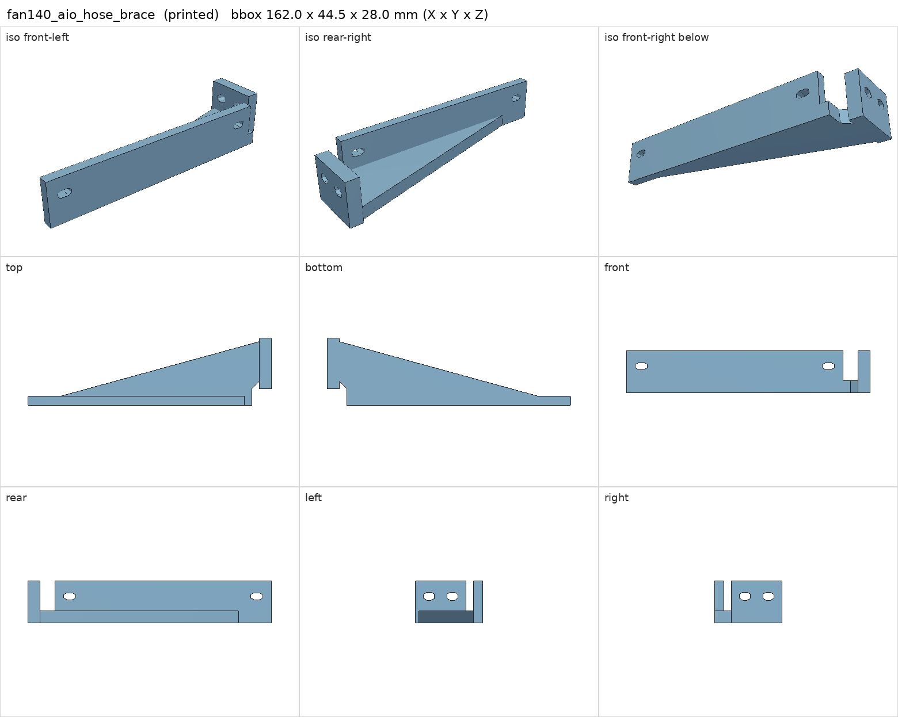

# fan140_aio_hose_brace

<!-- Generated by make check from part.toml. Edit part.toml, not this file. -->

| | |
| --- | --- |
| ID | `fan140_aio_hose_brace` |
| Category | printed |
| Print | PETG; plates are in each build's print/ |

## Used in

| Build | Qty | Status | Role |
| --- | ---: | --- | --- |
| [aipc](../../../aipc/parts/fan140_aio_hose_brace.md) | 1 | design | hose-end brace for the 140 mm radiator |

## Model

- [fan140_aio_hose_brace.step](fan140_aio_hose_brace.step) and [fan140_aio_hose_brace.stl](fan140_aio_hose_brace.stl)
- Source: generated. Exported by cad/shelf_layout.py in shelf coordinates; print/ re-orients it on the plate.
- Written by the `aipc` build's generator

## Datasheets

- None recorded. 

## Dimensions

| Key | Value | Evidence | Source / note |
| --- | --- | --- | --- |
| mass | 0.0415 kg | allowance | OrcaSlicer filament estimate |

